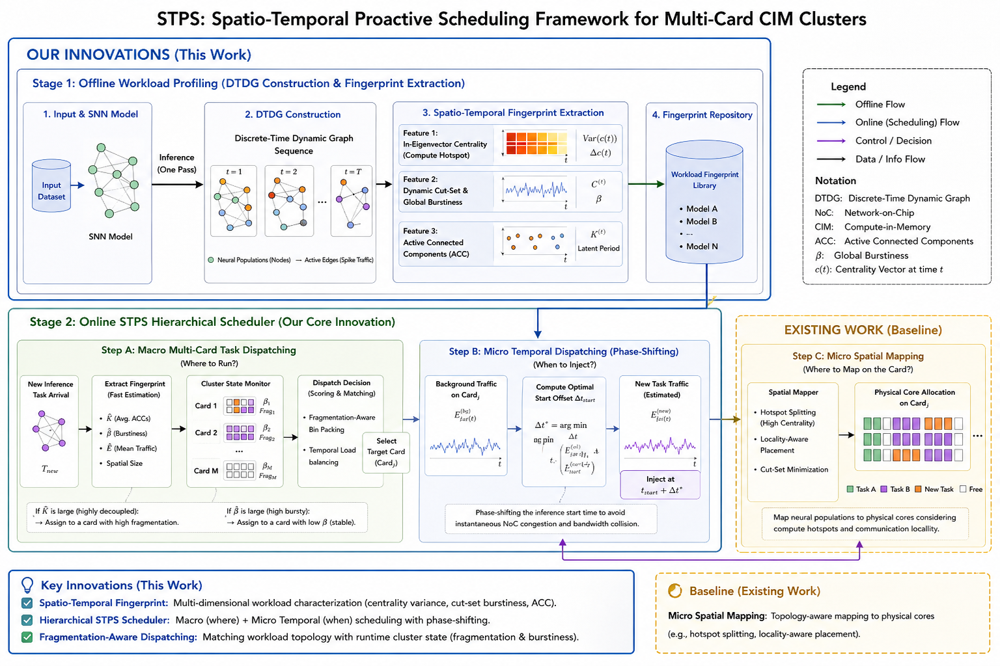

# STPS — Spatio-Temporal Proactive Scheduling for SNN Inference on CIM Clusters

Simulation framework for scheduling **Spiking Neural Network (SNN)** inference tasks on a multi-card **Compute-in-Memory (CIM / Darwin)** cluster. STPS decouples the underlying time-dependent MINLP scheduling problem into an **offline workload-fingerprinting** stage and an **online 3-stage hierarchical scheduler**, and ships with several baselines for comparison.

See [article.tex](article.tex) §4 (System Design) and §5 (Evaluation) for the full design, and [docs/stps.md](docs/stps.md) for the code-side bridge.



## Method at a Glance

**Offline — DTDG workload fingerprinting** ([fingerprint/](fingerprint/))
Convert an SNN trace into a Discrete-Time Dynamic Graph and extract four physical fingerprints:

- traffic timeline $E^{(t)}$
- global burstiness $\beta$
- in-eigenvector centrality variance $\mathrm{Var}(c^{(t)})$
- active connected components $\bar{K}$

**Online — 3-stage hierarchical scheduler** ([schedule/stps.py](schedule/stps.py))

1. **Macro-Card Dispatching** — pick a card based on forecast traffic and capacity.
2. **Micro-Temporal Phase-Shifting** — Algorithm 1, cross-correlation kernel ([schedule/phase_shift.py](schedule/phase_shift.py)).
3. **Micro-Spatial Mapping with Hotspot Splitting** — centrality-driven population split ([schedule/hotspot_split.py](schedule/hotspot_split.py)).

## Repository Layout

| Path | Purpose |
|------|---------|
| [main.py](main.py) | CLI entry; parses args, calls `simulation.engine.run_simulation`. |
| [simulation/engine.py](simulation/engine.py) | Lifecycle: arrivals, placement, two-tier ticks, metrics, completion. |
| [fingerprint/](fingerprint/) | DTDG fingerprint extraction (`extractor`, `centrality`, `dtdg`, `synth`, `io`, `cli`). |
| [schedule/](schedule/) | Pluggable schedulers (`stps`, baselines) + placement strategies. |
| [util/](util/) | Card resource model, task model, sim helpers, metrics. |
| [Makefile](Makefile) | Workflow driver (baselines, STPS family, fingerprints, compare). |
| `data/` `log/` `npz/` | Output CSVs, run logs, `.npz` fingerprints. |

## Installation

```bash
python -m venv .venv && source .venv/bin/activate
pip install -r requirements.txt
```

Core dependency is **NumPy**; PyTorch / Stable-Baselines3 / Gymnasium are needed only for the DRL baselines and for reading SpikingJelly traces (`fingerprint/dtdg.py` lazy-imports torch).

## Quick Start

```bash
make fingerprints    # generate synthetic *.npz fingerprints
make stps            # run full 3-stage STPS
make compare-stps    # baselines + STPS family (paper Q1/Q3)
```

Direct CLI:

```bash
python main.py --scheduler stps --cards 4 --tasks 128 --steps 128 \
    --arrival-mode bursty --fingerprint-dir npz \
    --bw-max 5e6 --d-max 16 --horizon 64

python main.py --list-schedulers
```

Offline fingerprint extraction (synthetic):

```bash
python -m fingerprint.cli --synthetic --T 64 --beta 4 --K 2 \
    --out npz/synthetic_bursty.npz
```

## Make Targets

**Baselines:** `make bestfit | drf | p2c | rr`
**STPS family:** `make stps | stps-spatial | stps-temporal`
**Bundles:** `make compare` (baselines), `make compare-stps` (baselines + STPS family)
**Utilities:** `make fingerprints`, `make list-schedulers`, `make clean`, `make help`

Ablations:

- `stps-spatial` — Stage 1 + Stage 3 only (no phase shift).
- `stps-temporal` — Stage 2 only (no fragmentation / no hotspot split).

## Parameters

Override any knob via env var, e.g. `CARDS=8 TASKS=200 ARRIVAL_MODE=poisson SEED=99 BW_MAX=5e6 make stps`.

| Var | Default | Meaning |
|-----|---------|---------|
| `CARDS` | 4 | accelerator card count |
| `TASKS` | 512 | total tasks scheduled |
| `STEPS` | 512 | simulation time steps |
| `SEED` | 21 | RNG seed |
| `ARRIVAL_MODE` | `bursty` | `poisson` / `bursty` / `mixed` |
| `FINGERPRINT_DIR` | `npz` | dir of `.npz` fingerprints (STPS only) |
| `BW_MAX` | `5e6` | NoC bandwidth ceiling per card |
| `D_MAX` | 16 | max phase-shift delay (ticks) |
| `HORIZON` | 64 | forecast traffic horizon (ticks) |
| `SPLIT_THRESHOLD` | 0.2 | hotspot-split threshold on centrality |
| `DATA_OUTPUT` | *(timestamp)* | filename prefix for `data/{scheduler}` CSV outputs |

The `--fingerprint-dir`, `--bw-max`, `--d-max`, `--horizon`, `--centrality-split-threshold` flags are no-ops for non-STPS schedulers — defaults are chosen so existing baseline runs remain bit-equivalent.

## Schedulers

Built-in (all registered via [schedule/__init__.py](schedule/__init__.py)):

- **STPS family** — `stps`, `stps-spatial`, `stps-temporal`
- **Baselines** — `bestfit`, `drf`, `p2c`, `rr`

Run `python main.py --list-schedulers` to enumerate at runtime.

## Extending

**New scheduler.** Add a module under [schedule/](schedule/), subclass `BaseScheduler` from [schedule/base.py](schedule/base.py), and register with `register_scheduler(...)` so `--list-schedulers` and Make targets pick it up.

**New placement strategy.** Subclass `BaseScheduler` and override `select_card_for_task` to implement your own placement logic.

**Fingerprints.** `.npz` files produced by `fingerprint.io.save_fingerprint`; schema documented in [docs/stps.md](docs/stps.md). Tasks reference fingerprints by path; `STPSScheduler._resolve_fingerprint` lazy-loads them.

**Outputs.** CSVs follow `data/{scheduler}_loads_*.csv` and `data/{scheduler}_summary_*.csv`; override the prefix with `--data-output` (or `DATA_OUTPUT=`).

When adding a CLI parameter, keep [main.py](main.py) and the Makefile `COMMON_ARGS` / `STPS_ARGS` in sync.

## Documentation

- [article.tex](article.tex) — paper source (§4 System Design, §5 Evaluation)
- [docs/stps.md](docs/stps.md) — code-side bridge for the STPS design
- [TODO.md](TODO.md) — implementation plan (kept for traceability)
- [CLAUDE.md](CLAUDE.md) / [AGENTS.md](AGENTS.md) — guidance for AI coding assistants
