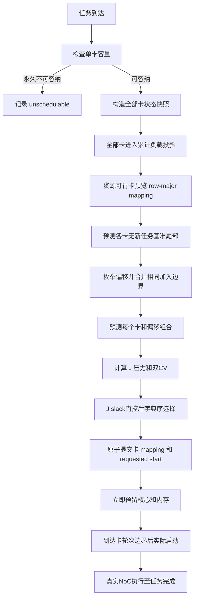

# STPS：基于 NoC 尾部预测的联合卡与启动偏移调度

STPS 在任务到达时联合选择一张物理卡和一个启动偏移。任务完整部署在所选卡上，卡间没有通信；卡内 MicroPopulation 使用统一的 `row-major-free-v1` 规则映射到当前空闲核。算法搜索卡和偏移，不搜索不同核映射。

当前 STPS 定义为 `objective=balance`：先限制预计完成代价，再最小化跨卡累计计算负载和通信负载的不均衡。场景显式设置 `balance_slack=0` 和 `adaptive_ledger=False`，不依赖 `STPSConfig` 的通用缺省值。

实现入口为[联合选择器](../schedule/stps.py)、[预测指纹](../fingerprint/scheduling.py)、[集群循环](../simulation/cluster_engine.py)和[单卡运行时](../simulation/card_runtime.py)。网络与测量口径见[架构](arch.md)和[指标](metrics.md)。

## 1. 调度问题

设集群有 $M$ 张同构卡。任务 $\tau$ 在物理 Tick $t$ 到达后，调度器选择：

$$
(m^*,d^*)\in\mathcal A_t,\qquad d\in\{0,1,\ldots,D_{max}\}.
$$

$m$ 是资源可行卡，$d$ 是从放置时刻开始计算的请求启动偏移。放置完成后：

$$
requested\_start=t+d.
$$

实际启动还受卡内轮次边界约束。若 `requested_start` 落在一个尚未结束的卡轮次内，任务在该轮次排空后的下一个物理 Tick 启动。偏移决定任务加入哪个卡轮次以及与现有任务的逻辑步对齐关系。

每个卡轮次中，所有运行任务各发出一个逻辑步的 SOP 和通信请求。每物理 Tick 提供固定 $K$ 个 NoC cycle；未完成 Rx 的包保留在队列中，整张卡继续当前轮次。全部包到达后，卡上任务在下一物理 Tick 共同推进。

STPS同时考虑以下量：

- 新任务和已有任务的预计完成时间；
- 固定映射下的源、目的和共享 XY 链路压力；
- 卡间累计计算 SOP 分配；
- 卡间累计 offered 通信端点事件分配；
- 主动启动偏移带来的等待。

计算 SOP 目前是工作量记账，没有计算服务周期。它参与负载均衡与压力排序，不转换成 NoC cycle。

当前算法参数为：

| 参数 | 当前值 | 作用 |
| --- | ---: | --- |
| `d_max` | 4 Tick | 每张可行卡的最大请求启动偏移 |
| `gamma` | 1.4 | 当前合成网络工作点的轮次时长修正系数 |
| `max_rounds` | 10000 | 单次完整尾部预测的轮次保护上限 |
| `balance_slack` | 0 | 只允许最小完成成本候选进入均衡排序 |
| `compute_weight` | 1 | 投影计算CV权重 |
| `noc_weight` | 1 | 投影通信CV权重 |
| `adaptive_ledger` | False | 累计账本始终使用独立离线指纹，不读取测试轨迹修正调度状态 |

## 2. 离线预测指纹

### 2.1 数据结构

每类任务使用独立校准样本生成一个 `SchedulingFingerprint`：

| 字段 | 形状 | 含义 |
| --- | --- | --- |
| `pop_size` | $[N]$ | 每个 MicroPopulation 的神经元数 |
| `edge_src`, `edge_dst` | $[E]$ | 有向逻辑边 |
| `expected_edge_flits` | $[T,E]$ | 每逻辑步、每条边的预计 flit 数 |
| `compute_total_sops` | $[T]$ | 每逻辑步的全任务 SOP 总量 |
| `state_size_mb` | 标量 | 任务状态内存 |
| `source`, `metadata` | 元数据 | 模型、采样和编码来源 |

预测文件只保存在线决策实际使用的粒度。逐 MicroPopulation 的实际 SOP 仍保留在重放 `Workload` 中，用于仿真与核级统计。

任务请求同时引用预测指纹和测试 Workload。加载器要求两者的 $T$、`pop_size`、边顺序和内存大小一致，允许每步 flit 和 SOP 数值不同。调度器只能读取预测指纹和已经发生的运行状态，不能读取测试 Workload 的未来步骤。

离线生成过程为：

1. 固定模型、逻辑步数、MicroPopulation切分和有向边顺序；
2. 对每个独立校准样本执行SNN前向，采集逐逻辑步脉冲活动；
3. 按明确的包编码生成每条逻辑边的期望flit，不从SOP反推通信；
4. 按明确的算子范围计算逐MicroPopulation SOP，不从flit反推计算；
5. 将该样本导出为完整Workload并完成逐边累计余数量化；
6. 对多个已量化Workload构建均值SchedulingFingerprint；
7. 保存样本来源、数量、量化规则和模型信息，并记录文件hash。

通信编码和SOP范围属于指纹数据契约。当前预测器只消费导出的边flit与总SOP，不猜测模型连接，也不把突触扇出自动当作NoC包数。

### 2.2 校准样本聚合

每个校准样本先独立完成 flit 量化，再形成均值：

$$
\widehat f_{s,e}=\frac{1}{B}\sum_{b=1}^{B}f^{(b)}_{s,e},\qquad
\widehat C_s=\frac{1}{B}\sum_{b=1}^{B}\sum_{i=1}^{N}Q^{(b)}_{s,i}.
$$

$f^{(b)}$ 是样本量化后的整数 flit 轨迹，$Q^{(b)}$ 是该样本的 SOP。均值可以是小数，在线预测直接使用该期望值；真实网络仍重放测试样本自己的整数 flit。

指纹派生两个任务总量，用于跨卡累计账本：

$$
C_\tau=\sum_{s=0}^{T-1}\widehat C_s,\qquad
N_\tau=2\sum_{s=0}^{T-1}\sum_{e:\,src_e\ne dst_e}\widehat f_{s,e}.
$$

$N_\tau$ 是 offered 端点事件数。一个跨核 flit 在源注入和目的接收各贡献一次；自环不进入 NoC。

### 2.3 网络时长校准

给定固定 mapping，预测器将逻辑边投影到 row-major 二维 mesh 的 XY 路径。对一轮通信定义未校准 cycle 代理：

$$
L=\max\left(
\mathbf 1_{F_{flit}>0}(h_{max}+2),
\max_c V_c^{src},
\max_c V_c^{dst},
\max_l V_l^{link},
\max_c P\left(V_c^{dst}-B_c^{free}\right)_+
\right).
$$

其中：

- $F_{flit}$ 是本轮跨核flit总数；$h_{max}+2$ 是非零通信时最长路径的 hop、注入和 Rx 下界；
- $V_c^{src}$ 是源核注入量；
- $V_c^{dst}$ 是目的核接收量；
- $V_l^{link}$ 是有向链路共享量；
- $P$ 是目的 NI 消费周期；
- $B_c^{free}$ 是目的 NI 当前空位。

无跨核通信时，本轮仍占一个物理 Tick。离线校准在相同 NoC 参数和 mapper 下测量真实清空 cycle，并拟合：

$$
\gamma=\max\left(1,Q_{0.9}\left(\frac{D_{actual}}{L}\right)\right).
$$

在线预计通信 cycle 为 $\lceil\gamma L\rceil$，再按 $K$ 向上取整为物理 Tick 数。$\gamma$ 是当前网络工作点的经验修正，不是硬件最坏时延保证。

## 3. 在线状态快照

任务到达时，集群引擎为每张卡构造只读 `CardForecastState`：

| 状态 | 用途 |
| --- | --- |
| `tasks` | 未完成任务的profile、mapping、下一未发步骤和请求启动时刻 |
| `round_open` | 当前卡是否有未排空轮次 |
| `outstanding` | 源待发、源NI、Router和目的NI库存 |
| `mapping` | 新任务在该卡上的row-major空核预览 |
| `candidate_feasible` | 当前核数和内存是否允许放置 |
| `cumulative_assigned_*` | 计算与offered通信累计承诺账本 |
| `compute_budget_sops`, `noc_budget_endpoint` | 双负载压力归一化尺度 |

`next_step=steps_started`，表示下一条尚未生成的预测步骤。当前开放轮次已经生成的流量只由 `outstanding` 表示，预测器不会再次从profile生成该步。

库存按当前位置转换为剩余需求：

- `source_pending` 和 `source_ni`：仍需注入、剩余XY路径和Rx；
- `router`：从当前Router继续走剩余路径并Rx；
- `sink_ni`：已完成Rx，只占目的缓冲并等待消费。

所有配置卡都进入跨卡负载CV计算。当前不可放置的卡不生成候选组合。

## 4. 卡内尾部预测

### 4.1 基准尾部

对每张资源可行卡，预测器先在不加入新任务的情况下模拟所有当前已知任务的剩余轮次：

1. 若卡有开放轮次，先从真实库存当前位置预测其剩余时长。
2. 在每个后续轮次起点，加入已运行任务和 `requested_start_tick` 已到的预留任务。
3. 每个参与任务读取自己的下一条profile步骤。
4. 合并所有任务的SOP、源流量、目的流量和XY链路流量。
5. 使用校准cycle代理和目的NI容量修正得到轮次Tick数。
6. 更新逻辑步骤、任务完成时刻和目的NI聚合库存。
7. 重复至全部已知任务完成。

预测器保存每个轮次的物理起止Tick、已有任务完成时刻、计算峰值、通信端点峰值和当前残余轮次长度。`max_rounds`为显式保护上限，超出时直接报错。

目的NI采用聚合容量近似。预测器按全局消费周期计算轮次内可用的消费机会，并用闭式修正保证轮次末库存不超过容量。它没有逐flit复刻真实Router仲裁，预测误差需要单独测量。

### 4.2 偏移与加入边界去重

对每个整数偏移 $d\in[0,D_{max}]$，先计算请求时刻 $t+d$。如果该时刻落在基准尾部某个开放轮次内，实际加入边界是该轮次结束后的下一个Tick。

多个偏移可能得到相同加入边界。算法只保留其中最小偏移，避免重复预测等价组合。设卡 $m$ 去重后有 $q_m\le D_{max}+1$ 个候选。

### 4.3 插入新任务

对每个去重后的 $(m,d)$：

1. 使用该卡的预览mapping创建候选任务；
2. 设置 `requested_start_tick=t+d`；
3. 从同一真实快照重新预测完整已知尾部；
4. 记录新任务预计开始和完成时刻；
5. 记录已有任务插入前后的预计完成时刻；
6. 记录尾部计算峰值和通信端点峰值。

同一张卡的基准尾部、XY路径和每步需求投影在一次决策中复用。

## 5. 联合目标函数

### 5.1 完成代价

候选 $(m,d)$ 的新任务完成代价为：

$$
T_{new}(m,d)=\widehat t^{finish}_{\tau,m,d}-t+1.
$$

对已有任务造成的非负拖慢为：

$$
E(m,d)=\sum_{j\in A_m}\max\left(0,\widehat t^{finish,+}_{j,m,d}-\widehat t^{finish,0}_{j,m}\right).
$$

联合完成成本：

$$
J(m,d)=T_{new}(m,d)+E(m,d).
$$

这使主动延迟、新任务完成时间和对共卡任务的影响进入同一个量。

### 5.2 双负载累计账本

每张卡维护从仿真开始至当前时刻的累计任务承诺：

$$
A_m^C=\text{累计计算SOP},\qquad A_m^N=\text{累计offered端点事件}.
$$

任务放置时加入完整profile总量 $C_\tau,N_\tau$。任务完成后保留历史累计量，使算法优化一段时间内的跨卡工作分配。账本不使用测试Workload修正，因而在线决策始终只依赖独立离线指纹和已经发生的网络状态。

将新任务放入卡 $m$ 后，分别对全部 $M$ 张卡计算投影CV：

$$
CV_C(m)=CV(A_1^C,\ldots,A_m^C+C_\tau,\ldots,A_M^C),
$$

$$
CV_N(m)=CV(A_1^N,\ldots,A_m^N+N_\tau,\ldots,A_M^N).
$$

同一卡的所有偏移共享这两个累计投影，因为偏移不改变任务总工作量。

双负载均衡分数为：

$$
B_{max}(m)=\max(w_CCV_C(m),w_NCV_N(m)),
$$

$$
B_{sum}(m)=w_CCV_C(m)+w_NCV_N(m).
$$

### 5.3 完成约束内选择负载更均衡的组合

先求所有卡和偏移组合中的最小完成成本：

$$
J_{min}=\min_{(m,d)\in\mathcal A_t}J(m,d).
$$

只保留满足下式的组合：

$$
J(m,d)\le J_{min}(1+\epsilon)+10^{-12},\qquad\epsilon=balance\_slack.
$$

对保留组合按以下字典序选择唯一结果：

$$
\left(
B_{max}(m),
B_{sum}(m),
J(m,d),
P(m,d),
d,
m
\right).
$$

其中瞬时双负载压力为：

$$
P(m,d)=\max\left(\frac{C^{peak}_{m,d}}{B_m^C},\frac{N^{peak}_{m,d}}{B_m^N}\right).
$$

$B_m^C$和$B_m^N$是评分归一化尺度，不是准入阈值。当前热点实验设置$\epsilon=0$，因此只在最小$J$候选之间优化累计双负载均衡。

## 6. 完整在线过程



同一物理Tick到达的任务按 `(arrival_tick, task_id)` 顺序处理。每次成功放置立即更新资源预留和累计账本，后续任务看到更新后的状态。资源暂时不足的任务保留在待放置队列，下一Tick重新尝试；永久超过单卡容量的任务直接拒绝。

提交采用以下生命周期：

1. `placement_tick=t`；
2. 立即预留mapping中的核与任务内存；
3. `requested_start_tick=t+d`；
4. 在requested时刻之后的第一个卡轮次边界设置`actual_start_tick`；
5. 已运行任务在等待期间继续推进；
6. 真实完成屏障通过后释放核与内存；
7. 累计双负载账本保留历史贡献。

预览mapping与提交mapping必须一致，否则运行时抛出断言错误。STPS不迁移已放置任务，也不修改已经提交的偏移。

## 7. 伪代码

```python
def schedule_stps(request, cards, tick, config):
    states = [snapshot(card, request, tick) for card in cards]
    projected_balance = project_cluster_cv(states, request.profile, config)
    candidates = []

    for state in states:
        if not state.candidate_feasible:
            continue

        residual, sink = observed_inventory(state)
        baseline = predict_tail(state, residual, sink)

        for delay, join_tick in distinct_join_boundaries(
            baseline, tick, config.d_max
        ):
            forecast = predict_tail_with_new_task(
                state=state,
                profile=request.profile,
                mapping=state.mapping,
                requested_start=tick + delay,
                residual=residual,
                sink=sink,
            )
            candidates.append(score(
                baseline, forecast, projected_balance[state.card_id], delay
            ))

    if not candidates:
        return None

    min_j = min(candidate.J for candidate in candidates)
    admitted = [candidate for candidate in candidates
                if candidate.J <= min_j * (1 + config.balance_slack) + 1e-12]

    return min(admitted, key=lambda candidate: (
        candidate.balance_max,
        candidate.balance_sum,
        candidate.J,
        candidate.pressure,
        candidate.delay,
        candidate.card_id,
    ))
```

## 8. 输出与可审计性

`decisions.csv`保存每次放置尝试及全部实际评估候选，包括：

- 卡号、偏移和固定mapping；
- 预计实际启动与完成Tick；
- `completion_cost`、`externality_ticks`和$J$；
- `peak_comp`、`peak_noc`和`pressure`；
- 投影计算CV、通信CV、`balance_max`和`balance_sum`；
- 已有任务插入前后的预计完成时刻；
- 是否通过$J$门控及门控上界。

`card_resources.csv`逐Tick保存每卡资源和累计账本。manifest保存STPS配置、候选总数、调度耗时、延迟任务数、profile路径/hash，以及预测开始/完成误差。真实执行结果始终来自NoC事件和卡内Rx屏障。

## 9. 复杂度

定义：

- $M$：配置卡数；$F$：当前资源可行卡数；
- $C$：每卡核心数；$L_{mesh}$：有向mesh链路数；
- $D=D_{max}+1$：原始偏移数；$q_m\le D$：卡$m$去重后的偏移数；
- $A_m$：卡$m$的未完成任务数；
- $R_j$、$E_j$：任务$j$的剩余逻辑步数和边数；
- $h_j$：任务$j$映射后的平均XY路径长度；$h$：当前库存包的最大剩余路径长度；
- $U_m$：预测尾部轮次数；$I_m$：当前库存记录数。

### 9.1 离线

若校准包含$B$个已经生成并量化的Workload，构建指纹的统计成本为：

$$
T_{profile}=O\left(BT(E+N)\right),\qquad
S_{profile}=O(TE+T+N+E).
$$

模型前向、脉冲采集和从稠密张量构造边流量的成本取决于提取器，应与上述聚合成本分开报告。

### 9.2 单次在线决策

当前mapper扫描核心列表得到空位，全部卡的快照与预览上界为$O(MC)$。每张可行卡的基准尾部预测一次，每个去重候选再预测一次。将一次该卡尾部预测记为：

$$
P_m=O\left(
\sum_{j\in A_m\cup\{\tau\}}R_j(1+E_jh_j)
+U_m(A_m+C+L_{mesh})
\right).
$$

则一次联合选择的主要时间复杂度为：

$$
O\left(
MC+\sum_{m=1}^{F}\left[I_mh+D+U_m+(1+q_m)P_m\right]+M
\right).
$$

末尾$O(M)$来自使用共享一、二阶矩计算所有落卡位置的投影CV。完整尾部预测通常是主导成本。候选数$O(FD)$本身不足以表示实际调度时间。

共享profile空间为$O(TE+T+N+E)$。一次决策还需要路径和逐步投影缓存、卡状态、预测轮次以及候选完成时刻字典；最坏候选日志空间为$O(FDA)$。

## 10. 评价指标与实现边界

算法评价同时使用：

- 计算负载：每卡SOP；
- offered通信负载：`2 × generated_tx`；
- served通信负载：`Tx + Rx`；
- 跨卡CV、JFI、LIF、P99-to-Mean和Max-to-Mean；
- 逐Tick及1/4/8 Tick完整滑动窗口的mean、P95、P99和max；
- 任务端到端时间、执行时间、主动等待、边界等待和通信延长；
- 源等待、Router等待、目的阻塞、包延迟与队列库存；
- 完成率、拒绝和截断状态。

offered与served需要同时报告，避免反压导致成功收发下降后被解释为负载较轻。4卡实验中nearest-rank P99等于最大卡，因此P99-to-Mean、LIF和Max-to-Mean数值相同，不能作为三份独立证据。

当前实现边界：

- mapping固定为row-major空核规则，路径敏感性仍然存在；
- 预测器是聚合NoC模型，不复刻逐flit仲裁；
- SOP没有执行服务时间，只表示计算工作量；
- profile来自合成小图校准，真实大型SNN和硬件时序仍需验证；
- 算法只知道已经到达的任务，不预测未来到达；
- 主动偏移会增加等待，降低局部热点不保证降低端到端时间。
