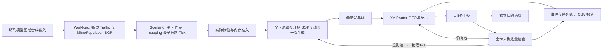

# 多卡多任务 SNN NoC 架构与数据流

当前模型使用固定物理 Tick 与弹性逻辑步：超过一个 Tick 的通信保留队列并顺延，全卡本轮全部Rx后才推进逻辑步。每个任务完整部署在一张卡，卡间没有数据传输；多卡共享物理时间，各自推进独立NoC与屏障。在线入口已实现RR、WorstFit、DRU、BestFit、P2C-Mean和联合搜索“卡＋启动偏移”的STPS。完整配置与指标见 [hyperparam.md](hyperparam.md)、[metrics.md](metrics.md)。

## 1. 数据路径

## 2. 对象与所有权

| 对象 | 当前职责 |
| --- | --- |
| [Workload](../fingerprint/workload.py) | 不可变pop_size[N]、有向源宿[E]、期望flit[T,E]、独立SOP[T,N]与来源单位；量化后多任务复用 |
| [SchedulingFingerprint](../fingerprint/scheduling.py) | 独立校准预测：逐边expected_edge_flits[T,E]、整任务compute_total_sops[T]、静态图/容量与来源；在线策略只消费预测数组 |
| [TaskPlacement/Scenario](../simulation/scenario.py) | 固定mapping、最早start_tick、单任务容量校验、网络参数、输入hash和max_ticks；planned_end_tick仅理想参考 |
| [TaskRequest/ClusterScenario](../simulation/cluster_scenario.py) | 外生arrival、测试Workload、独立profile引用/派生均值、同构卡配置和STPS参数；两类输入分别hash |
| [STPS选择器](../schedule/stps.py) | 只读候选卡快照，联合枚举卡/偏移、投影共同mapping下的XY需求、预测已知尾部并返回决定 |
| [CardRuntime](../simulation/card_runtime.py) | 每卡拥有独立网络/进度/统计，placement时预留资源，requested门槛与真实屏障决定actual start |
| [引擎_Progress](../simulation/engine.py) | 实际启动/完成、显式steps_started/completed、当前步起点、最后Rx、通信延长；管理运行时核位/内存 |
| [NoCNetwork](../simulation/noc.py) | 全卡唯一网络，源pending批次、有限源/宿NI、每Router五输入FIFO及轮转指针 |
| [SimulationMetrics/MetricsWriter](../util/metrics.py) | 核→任务→卡聚合、步骤与任务时间、延迟/等待、库存/队列/链路与manifest |
| [write_report](../simulation/report.py) | 自包含HTML/SVG、物理Tick曲线、MicroPopulation热图、逻辑步进度和slowdown |

## 3. mapping前后的数据抽象

图与切片pop_size/edge_src/edge_dst定义逻辑结构；mapping[i]将MicroPopulation i转成物理core_id。一MicroPopulation独占一核，core_id=y×mesh_x+x。固定单卡入口由场景给定mapping；在线多卡的六策略共同调用row-major-free-v1，将MicroPopulation索引对应此刻core_id递增的空闲核。STPS候选使用同一预览mapping，提交时校验未改变，不搜索其它映射。

发包/SOP是离线准备的T步轨迹。可使用手算合成、显式W[T,N,N,2]，或[命名hook](../fingerprint/dtdg.py)采样和[显式拓扑转换](../fingerprint/extractor.py)。模型采集选择同一样本/同批均值用于双方，不猜注册顺序。compute_per_flit仅算子SOP代理；重放不执行神经元计算，也不会根据Rx生成后续脉冲。

每条边按逻辑时间累积十进制余量floor得到整数flit。逻辑边i→j转换为mapping[i]→mapping[j]；自环只计local_flits，不进入NoC。单播每目标单独offer，没有运行时组播复制；所有发包批次集中在逻辑步起点。

校准与测试分开：每个校准Workload先完成上述量化，再按样本平均得到预测expected_edge_flits；compute_sops先按MicroPopulation求和，再按样本平均得到compute_total_sops。预测文件保留静态图、每逻辑步逐边需求和每步总SOP，不复制[T,N]计算数组。不同模型可有不同E，因而各自保存[T,E]；没有以卡数为首维的[C,T,E]预测artifact。映射依赖的源/宿/XY链路需求在决策时投影并缓存，卡与偏移不是离线指纹轴。

profile JSON使用独立kind=scheduling_fingerprint，不可当Workload载入。任务请求同时引用测试workload与预测profile，加载器只要求二者静态拓扑、T、pop_size和state_size_mb一致，允许流量和SOP不同。有profile时均值从profile派生，显式声明不一致会拒绝；STPS缺profile在创建输出前失败。样本来源、数量、逐样本量化规则存于metadata，在线选择器没有测试Workload参数。

## 4. 准入与生命周期

以下两段描述固定单卡入口；在线多卡入口的arrival、placement、主动偏移见第8节。

场景先校验每任务可独立放下、核编号互异、每核神经元和单任务内存。允许任务mapping重叠；加载时不按理想区间拒绝重叠，因为实际完成由网络决定。

待任务按(start_tick,task_id)排序，仅在全卡轮次边界尝试：最早时刻已到、所有固定核空闲且内存可用时实际启动。不满足就等待，后面的可行任务可以先启动。运行任务全程占核和state_size_mb，完成最后一步的全卡屏障才释放。

新任务不能在一个尚未排空的轮次中途加入。当卡屏障延长，已到时刻的新任务继续等待，actual_start_tick和task_start_wait_ticks明确记录。start_tick是当前端到端计量起点，没有独立外部arrival字段。

## 5. Tick循环与全卡屏障

物理Tick t覆盖[(t−1)K,tK)。若上一轮已结束，在起点准入新任务，并让每个运行任务开始自己的下一个逻辑步，SOP/请求只生成一次。随后推进K cycle并检查守恒与全卡pending_delivery。

- 未到达量>0：保留全部队列，记录barrier_ready=False，下Tick继续当前轮次；不再记SOP或新生成量。
- 未到达量=0：共同屏障通过，各参与任务steps_completed加1；末步任务完成；下一物理Tick才开始新轮。
- 目的NI内已Rx未消费量不阻止屏障，但保留身份/占位，能反压后续包。
- 零通信步最少1物理Tick；它也会因同卡其它任务未送达而等待。
- 全任务完成就结束，不额外排空已Rx库存；max_ticks到达仍未完成返回不完整，CLI退出2。

不能再用logical_tick=physical_tick-start_tick。一个步在物理Tick5生成、Tick6继续传输、Tick6末Rx排空，就在Tick7开始下一步；逻辑步5→6之前多占的Tick记录为communication_extension。

## 6. 网络传输和拥塞

XY先X后Y，每hop一完整cycle；源注入与目的Rx各一cycle，无等待最低h+2。所有决定读旧态，统一c+1提交；同cycle释放容量下cycle才可用，无遍历顺序多hop。

每个输出按N/E/S/W/Local轮转，最多一flit/cycle。多个输入请求同输出会产生arbitration等待，下游满产生downstream_full。源Router输入满产生tx_stall，目的NI满产生rx_blocked；反压可传播到源。没有数据丢弃或重传。

每任务G=Tx+源pending/NI、Tx=Rx+Router库存、Rx=Consumed+sink库存；每Tick检查。链路转移提交后包在下游Router，整数边界没有独立Link库存。每个包保留原task/logical/edge/src/dst/generated_cycle，核复用不改变旧sink包身份。

## 7. 观察与结果边界

core_tick按非零稀疏写，task_tick保留当前等待/零活动步，也可含原步消费行；card_tick从任务求和。step_timing区分自身最后Rx和全卡释放时间，task_summary给执行/端到端/启动等待/extension/slowdown。队列积分采K个cycle起点，峰值另外含最终提交边界，不多算samples。

manifest输出版本2，含真实时间模式、参数、hash、任务时间与全卡峰值；scenario副本解析workload绝对路径，可在本机重放。报告展示逻辑步跨物理Tick的重复进度，等待Tick的SOP/生成为0但Tx/Rx可能非零。

SOP没有服务时间；NoC cycle未做硅片校准。此全卡屏障/跨Tick性能模型不等于TrueNorth的包目标Tick scheduler。联合STPS的实际实现见[algo.md](algo.md)，单卡功能实验见[experiment.md](experiment.md)，当前多卡同二进制比较见[stps_hotspots.md](results/stps_hotspots.md)。预测降低完成成本与计算/通信窗口均衡改善是不同问题，必须从真实结果分别验证。

## 8. 在线多卡调度数据流

[cluster_scenario.py](../simulation/cluster_scenario.py)加载外生arrival_tick、逐步测试工作负载、预测profile/均值；[cluster_engine.py](../simulation/cluster_engine.py)按共享物理Tick处理已到达待任务。[schedule/baselines.py](../schedule/baselines.py)中的RR/WorstFit/DRU/BestFit/P2C-Mean使用d=0；[schedule/stps.py](../schedule/stps.py)在一次决定中联合选择候选卡和d∈[0,d_max]。

每次根据已运行和已预留任务检查核槽/内存，选卡后以row-major空核顺序原子预留并建立TaskPlacement。所有同Tick任务按(arrival_tick,task_id)逐个更新快照，资源暂满则等待下一Tick；不能独立容纳的任务记录unschedulable。TaskPlacement.start_tick保存requested_start_tick=placement_tick+d，card.placement_ticks另存实际放置时刻。主动延迟任务立即占用核心和内存，不等到actual start才扣资源。

[CardRuntime](../simulation/card_runtime.py)每卡拥有独立NoC、_Progress和SimulationMetrics；未生成的预留任务可在卡忙时放置，但只能在requested_start_tick≤当前Tick且卡轮次边界开放时加入。已有任务继续运行，不因新任务主动等待而暂停。各卡都执行相同物理Tick的K cycle，某卡长轮次不会阻止其它卡前进。完成末步共同屏障后释放资源和均值账本；核复用时旧sink身份继续保留。

端到端从arrival计量：resource_wait=placement−arrival，phase_wait=d，boundary_wait=actual−requested，execution=completion−actual+1；完成任务四项相加为completion−arrival+1。截断时主动等待只统计已观察部分，不把尚未发生的d全部计入；开始/完成未发生就保留null。卡内明细的start_tick口径是requested，跨策略端到端比较应读顶层task_summary。

各卡写cards/card_i单卡同语义明细，顶层[cluster_metrics.py](../simulation/cluster_metrics.py)流式合并并加入card_id。每Tick所有卡含空卡一起记录；窗口计算SOP与通信Tx+Rx分别累计，保留CV/JFI/LIF分子/分母。精确包p95由所有任务直方图合并。顶层[cluster_report.py](../simulation/cluster_report.py)绘制各卡活动/延长、资源预留和任务生命周期，紫色表示主动等待，并链接每卡报告。

多卡manifest版本3保存STPS配置、调度耗时/候选数、延迟任务数、profile路径/hash和任务预测起止/误差。decisions.csv保存全部实际评估候选、J分项、需求压力、固定mapping及已知任务插入前后预测完成时刻。预测不会替代真实资源释放，完整网络统计仍来自NoC事件。

## 9. STPS 快照、尾部预测与联合决策

一个调度时刻只对当前资源可行卡构造CardForecastState。每个ForecastTask引用共享profile与已提交mapping，next_step=steps_started表示下一尚未生成逻辑步；开放轮次已生成的流量仅由当前outstanding描述，不重复从profile生成。快照包含requested_start_tick、running、当前物理Tick、round_open、网络参数/预算和候选mapping。已完成任务不进入未来任务列表，遗留sink库存仍按真实当前位置占用目的NI容量。

先预测该卡不加入新任务的完整已知尾部；再枚举请求偏移，合并落到同一个预测加入边界的候选。每个候选把新任务加入同一快照，再预测全部已知任务直到完成。源NI、目的NI、共享XY链路、路径下界与目的消费压力形成cycle代理，gamma为离线系数，按K取整为物理轮长。目的NI库存采用有限容量聚合近似，消费机会跟随全局P周期，用闭式容量修正求轮长，不用逐cycle探测或无限循环。

同卡不同d共用路径和每步投影缓存；每次尾部预测受max_rounds保护，超限报错。新任务完成成本加对已有任务的非负完成延迟得到J，预测SOP/端点需求峰值经两种预算归一化取max得到pressure；最后按(J,pressure,d,card_id)选择。计算负载在J同分时参与，当前没有计算服务时延，不能用SOP字段推导计算加速。

这里预测的是已知任务的剩余尾部，不预知未来到达，也不读取测试Workload的未来活动。后续新任务可能造成预测完成误差；均值profile、聚合时长近似和后续干扰分别是需保留的解释边界。

## 10. 独立样本与比较实验数据流

[compare_stps.py](../script/compare_stps.py)先写plan.json，再建立四类小图各8个校准、4个验证样本，即合计32个校准和16个验证。校准生成共享预测profile并按预先固定q90规则确定gamma；验证只报告误差。测试样本和任务顺序使用独立种子，流量与SOP幅度分别扰动，保留稀疏零值时刻。所有策略共用相同测试Workload、到达和profile均值。

当前热点实验固定4卡×每卡4×4、K=8，Poisson/bursty两种到达、24/48任务、5个种子、六策略共120次。完整运行检查生成/Tx/Rx总量和SOP总量与输入一致，再按同模式、任务数、seed比较计算/offered通信/served通信的累计、逐Tick和1/4/8 Tick滑窗指标。原始记录、有效运行数、输入hash与运行manifest可逐级追溯。配置见[hyperparam.md](hyperparam.md)，结果分析见[stps_hotspots.md](results/stps_hotspots.md)；这些是合成小图验证，尚不构成真实大型模型或硬件证据。

## 11. 高频热点与滑动窗口观察

cluster_metrics在同一card_tick源上并行形成三类负载：计算SOP、offered通信（2×generated）与served端点活动（Tx+Rx）。每个Tick先对全部配置卡计算CV/JFI/LIF/P99-to-Mean/Max-to-Mean；full/steady再汇总这些比率时间序列的mean/P95/P99/max。全程累计均衡和短时热点是两套观察，不能互相替代。

可配置W Tick滑动窗口用每卡最近W Tick负载和计算跨卡多维指标，输出sliding_balance.csv。W=1显示瞬时尖峰，W=4/8观察短期积累和平滑效果；报告内嵌热点表和时间演进。若配置physical_tick_ms，毫秒窗口才可换算为Tick；否则仿真器不把Tick伪装成100ms。该统计不改变调度或NoC状态。
